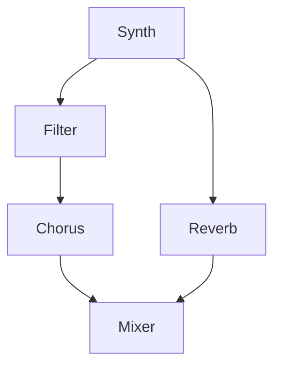

# Chapter 23: Digital Signal Processing — Effects and Mixing  
## Part 1: DSP Foundations, Audio Signal Flow, and System Architecture

---

## Table of Contents

- 23.1 Introduction: DSP in Workstation Design
- 23.2 DSP Fundamentals for Musicians and Engineers
  - 23.2.1 Digital Audio: Sampling, Quantization, and Aliasing
  - 23.2.2 Time Domain vs Frequency Domain Processing
  - 23.2.3 Latency, Buffer Size, and Real-Time Constraints
  - 23.2.4 Fixed Point vs Floating Point DSP
  - 23.2.5 Dynamic Range, Noise Floor, and Headroom
- 23.3 Audio Signal Flow in Workstations
  - 23.3.1 Typical Signal Flow Diagrams (Block Diagrams)
  - 23.3.2 Synth/Sampler Output to Mixer Busses
  - 23.3.3 Sends, Inserts, Returns, and Parallel Processing
  - 23.3.4 Channel Strip: EQ, Dynamics, Panning, Metering
  - 23.3.5 Master Section: Summing, Limiting, Metering
  - 23.3.6 Routing: Internal Busses, Groups, and External IO
- 23.4 DSP System Architecture
  - 23.4.1 Modular DSP Engine Design (Nodes, Graphs)
  - 23.4.2 Scheduling and Buffer Management
  - 23.4.3 Real-Time Prioritization and Threading
  - 23.4.4 Plugin and Algorithm Abstraction
  - 23.4.5 Parameter Modulation and Automation
  - 23.4.6 Integration with Sequencer, UI, and Storage
- 23.5 Glossary and Reference Tables

---

## 23.1 Introduction: DSP in Workstation Design

Digital Signal Processing (DSP) is at the heart of every modern workstation, sampler, and synthesizer.  
It enables:
- Real-time sound generation, transformation, and mixing
- Effects processing: reverb, delay, EQ, compression, distortion, modulation
- Efficient use of computation and memory — from embedded chips to desktop CPUs
- Flexible routing, modulation, and automation of sound parameters

A robust DSP architecture allows for both classic sound design and modern, modular, or algorithmic workflows.  
Understanding these fundamentals is essential for anyone building or optimizing music workstations.

---

## 23.2 DSP Fundamentals for Musicians and Engineers

### 23.2.1 Digital Audio: Sampling, Quantization, and Aliasing

- **Sampling Rate:** Number of audio samples per second (e.g., 44.1kHz, 48kHz, 96kHz). Determines maximum frequency (Nyquist = half of sample rate).
- **Quantization:** Rounding analog signal to nearest digital value; bit depth (8/12/16/24/32 bits) determines dynamic range and noise floor.
- **Aliasing:** High frequencies fold back into audible range if not properly filtered (anti-aliasing filter required before ADC).
- **Oversampling:** Processing at higher-than-output sample rate to reduce aliasing and improve quality in nonlinear and modulation-heavy FX.

#### 23.2.1.1 Table: Bit Depth and Dynamic Range

| Bit Depth | Theoretical Dynamic Range |
|-----------|--------------------------|
| 8         | ~48 dB                   |
| 12        | ~72 dB                   |
| 16        | ~96 dB                   |
| 24        | ~144 dB                  |
| 32 float  | ~1500 dB (theoretical)   |

#### 23.2.1.2 Example: Aliasing in Simple Oscillator

- A naive digital sawtooth at 44.1kHz will alias above 11kHz; use bandlimited (BLEP, PolyBLEP) or oversampled designs.

### 23.2.2 Time Domain vs Frequency Domain Processing

- **Time Domain:** Direct manipulation of samples (e.g., delay lines, IIR/FIR filters, gain, distortion).
- **Frequency Domain:** Transform (FFT, DFT) to analyze/process frequency content (e.g., spectral EQ, vocoding, convolution reverb).
- **Hybrid:** Some FX (e.g., time-stretching, pitch-shift) use both domains.

#### 23.2.2.1 Table: Typical Use Cases

| Domain         | Common FX/Processes               |
|----------------|----------------------------------|
| Time Domain    | Delay, chorus, compressor, EQ     |
| Frequency      | Spectral EQ, vocoder, convolution |
| Hybrid         | Pitch-shift, time-stretch         |

### 23.2.3 Latency, Buffer Size, and Real-Time Constraints

- **Latency:** Delay from input to output; sum of buffer size, processing time, and system overhead.
- **Buffer Size:** Trade-off between low latency (small buffers, more CPU) and stability (large buffers, more delay).
- **Real-Time:** DSP must process each buffer in less time than buffer duration; otherwise dropouts or glitches occur.

#### 23.2.3.1 Buffer Size Table

| Buffer Size | Latency (@48kHz) | Typical Use          |
|-------------|------------------|----------------------|
| 64 samples  | ~1.33 ms         | Pro audio, live      |
| 128         | ~2.7 ms          | Low-latency studio   |
| 256         | ~5.3 ms          | Home studio, desktop |
| 512+        | >10 ms           | Mixing, mastering    |

### 23.2.4 Fixed Point vs Floating Point DSP

- **Fixed Point:** Efficient on low-power CPUs/DSPs, but limited dynamic range; must carefully manage scaling.
- **Floating Point:** More forgiving, higher quality, but can be slower and more power-hungry.
- **Hybrid:** Some systems use float for mixing, fixed for I/O or legacy algorithms.

#### 23.2.4.1 Example: Fixed Point Scaling

```c
// Q15 format (int16, -1.0 to +0.9999)
int16_t a = 16384; // 0.5
int16_t b = 8192;  // 0.25
int16_t result = (a * b) >> 15; // Multiplication with scaling
```

### 23.2.5 Dynamic Range, Noise Floor, and Headroom

- **Dynamic Range:** Difference between quietest and loudest non-distorted signal.
- **Noise Floor:** Minimum detectable signal; determined by bit depth and electronics.
- **Headroom:** Extra space above nominal 0dBFS to accommodate peaks/transients; prevents digital clipping.
- **Dithering:** Adds low-level noise to mask quantization distortion during bit depth reduction.

---

## 23.3 Audio Signal Flow in Workstations

### 23.3.1 Typical Signal Flow Diagrams (Block Diagrams)

- **Block Diagram:** Visual representation of audio paths; includes sources (oscillators, samplers), processors (filters, FX), and destinations (mix busses, outputs).
- **Signal Chain:** Order of processing matters—e.g., EQ before compressor vs after.

#### 23.3.1.1 Example Block Diagram

```
[Synth/Sampler] → [Insert FX] → [Channel Strip] → [Bus FX] → [Master] → [Output]
```

### 23.3.2 Synth/Sampler Output to Mixer Busses

- **Direct Out:** Each sound engine feeds individual channel strip.
- **Bussing:** Multiple instruments to a group bus for shared FX, compression, or volume control.
- **Aux Sends:** Parallel path for FX like reverb/delay; dry signal continues unaffected.

### 23.3.3 Sends, Inserts, Returns, and Parallel Processing

- **Send:** Portion of signal sent to FX and returned to mix; used for shared FX (reverb, delay).
- **Insert:** FX sits directly in the signal path; 100% wet/dry control.
- **Return:** Dedicated channel for bringing FX output back into mix.
- **Parallel FX:** FX runs alongside dry path (e.g., parallel compression, NY compression).

#### 23.3.3.1 Example: Parallel Compression

```
[Dry Signal] ─┬─> [Mix]
              │
[Comp FX] <───┘
```

### 23.3.4 Channel Strip: EQ, Dynamics, Panning, Metering

- **Channel Strip Components:**
  - **EQ:** Tone shaping, parametric or graphic, pre/post-fader.
  - **Dynamics:** Compressor, limiter, gate, expander.
  - **Panning:** Stereo/3D placement.
  - **Metering:** Level, peak, RMS, gain reduction.
  - **Fader:** Volume control.

#### 23.3.4.1 Example: Channel Strip Block

```
[Input] → [Gain] → [EQ] → [Compressor] → [Pan] → [Fader] → [Bus]
```

### 23.3.5 Master Section: Summing, Limiting, Metering

- **Summing:** All busses mixed to stereo/mono output.
- **Master FX:** Limiter, master EQ, dithering, stereo enhancer.
- **Metering:** Output level, true peak, LUFS, clipping indicators.
- **Monitoring:** Option for pre/post-fader, solo/mute.

### 23.3.6 Routing: Internal Busses, Groups, and External IO

- **Internal Busses:** For submixes, FX sends, stems.
- **Groups:** Multiple channels controlled as a unit (drum group, backing vocals, etc.).
- **External IO:** Physical outputs, ADAT, SPDIF, USB audio, insert points for hardware FX.

---

## 23.4 DSP System Architecture

### 23.4.1 Modular DSP Engine Design (Nodes, Graphs)

- **Node-Based Engine:** Each processor (oscillator, filter, FX) is a node; nodes connected in a graph.
- **Directed Acyclic Graph (DAG):** Ensures no processing cycles; critical for deterministic scheduling.
- **Custom Routing:** User can rewire FX, split/merge signals, create feedback loops (with care).

#### 23.4.1.1 Example: Modular DSP Graph



### 23.4.2 Scheduling and Buffer Management

- **Scheduling:** Determine order of processing nodes; must respect dependencies (inputs before outputs).
- **Buffer Management:** Each node processes one audio buffer per cycle; manage buffer pools to minimize allocation/free overhead.
- **Double Buffering:** Ensures safe handoff between DSP and audio out.

### 23.4.3 Real-Time Prioritization and Threading

- **Audio Thread:** Highest priority; must never block or wait on slow operations (disk I/O, UI).
- **Worker Threads:** Background rendering, FX pre-calc, offline processes.
- **Inter-Thread Communication:** Lock-free queues or ring buffers for audio-safe messaging.

### 23.4.4 Plugin and Algorithm Abstraction

- **Plugin API:** Standard interface for DSP blocks (e.g., VST, AU, LV2, internal).
- **Parameter Management:** Expose automatable parameters, smooth changes to avoid zipper noise.
- **Hot Swap:** Replace or update FX/plugins at runtime with minimal audio disruption.

### 23.4.5 Parameter Modulation and Automation

- **Modulation Sources:** LFOs, envelopes, step sequencers, MIDI CC, macros.
- **Automation:** Timeline-based parameter changes (DAW, internal sequencer).
- **Resolution:** Smooth/stepped, sample/block accurate.
- **Host-Target Mapping:** Map modulation/automation to any plugin/FX parameter.

### 23.4.6 Integration with Sequencer, UI, and Storage

- **Sequencer:** Triggers automation, FX changes, dynamic routing.
- **UI:** Real-time parameter feedback, metering, drag-and-drop FX chains.
- **Storage:** Persist DSP/FX settings, recall per patch/song/project.

---

## 23.5 Glossary and Reference Tables

| Term          | Definition                                         |
|---------------|----------------------------------------------------|
| DSP           | Digital Signal Processing                          |
| Sample Rate   | Audio samples per second (Hz)                      |
| Buffer        | Block of audio samples processed at once           |
| Node          | Audio processor in DSP graph                       |
| Bus           | Audio routing path for mixing/FX                   |
| Insert        | FX directly in signal chain                        |
| Send/Return   | Parallel FX routing                                |
| Latency       | Delay from input to output                         |
| Headroom      | Margin to prevent clipping                         |
| Dithering     | Noise to mask quantization error                   |

### 23.5.1 Table: DSP Block Types

| Block Type     | Use Case                    | Example FX           |
|----------------|-----------------------------|----------------------|
| Source         | Generate sound              | Osc, sampler, synth  |
| Filter         | Tone shaping                | EQ, LPF, HPF         |
| Modulation     | Modulate params             | LFO, env, step seq   |
| Dynamics       | Control volume              | Compressor, gate     |
| Delay          | Temporal FX                 | Delay, chorus, flanger|
| Reverb         | Simulate space              | Hall, plate, room    |
| Utility        | Meter, analyzer, router     | Meter, splitter      |

### 23.5.2 Table: Latency and Buffer Size

| Buffer Size | Latency (ms @48kHz) | Notes                       |
|-------------|---------------------|-----------------------------|
| 32          | 0.67                | Ultra-low, CPU-hungry       |
| 64          | 1.33                | Pro live, synths            |
| 128         | 2.67                | Studio default              |
| 256         | 5.33                | Mixing/mastering safe       |
| 512         | 10.67               | High stability, high latency|

### 23.5.3 DSP Best Practices

- **Always process audio in blocks, not per-sample, for CPU efficiency.**
- **Keep audio thread real-time safe—never allocate or block.**
- **Use modular, node-based DSP for maximum flexibility and expandability.**
- **Document signal flow and routing for user and developer clarity.**
- **Test your DSP for both low and high buffer sizes.**
- **Store all FX parameters with project/patch for total recall.**

---

**End of Part 1.**  
**Next: Part 2 will cover concrete DSP effects algorithms (EQ, filters, reverb, delay, distortion, compression, modulation), advanced routing, real-world code and math, parameter smoothing, mixing/mastering workflows, troubleshooting, and embedded DSP optimization.**

---