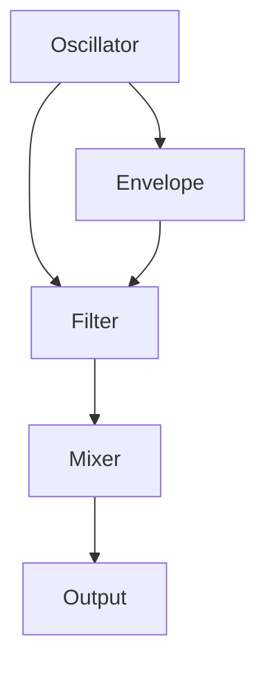

# Chapter 25: High-Performance Audio Scheduling  
## Part 1: Real-Time Audio Theory, Core Scheduling Patterns, and System Design

---

## Table of Contents

- 25.1 Introduction: Why High-Performance Audio Scheduling Matters
- 25.2 Fundamentals of Real-Time Audio Systems
  - 25.2.1 What is Real-Time? Hard vs. Soft Real-Time
  - 25.2.2 Audio Thread and Non-Audio Thread Separation
  - 25.2.3 Buffering and Latency: Concepts and Trade-Offs
  - 25.2.4 Jitter, Dropouts, Priority Inversion
- 25.3 The Audio Callback: Anatomy and Best Practices
  - 25.3.1 Callback Models: Push vs. Pull
  - 25.3.2 Callback Contracts: Timing, Deadlines, and Non-Blocking Rules
  - 25.3.3 Avoiding Priority Inversion and Blocking
  - 25.3.4 Communication with Other Threads (Lock-Free Queues, Atomics)
  - 25.3.5 Audio Callback in Embedded, Desktop, and Mobile Contexts
- 25.4 Scheduling Audio Work in Blocks and Graphs
  - 25.4.1 Block-Based DSP vs. Per-Sample Scheduling
  - 25.4.2 Audio Graphs: Topological Ordering and Dependency Resolution
  - 25.4.3 Dynamic Audio Graphs and Hot-Plug Processing
  - 25.4.4 Handling Variable Block Sizes and Sample Rates
- 25.5 Real-Time Safe Data Structures and Communication
  - 25.5.1 Single Producer Single Consumer (SPSC) Queues
  - 25.5.2 Multi-Producer Multi-Consumer (MPMC) Queues
  - 25.5.3 Atomic Variables and Memory Barriers
  - 25.5.4 Lock-Free Ring Buffers
  - 25.5.5 Message Passing and Event Notification
- 25.6 Prioritization, Preemption, and OS Scheduling Strategies
  - 25.6.1 Thread Priorities and OS Real-Time Scheduling Classes
  - 25.6.2 Priority Inversion and Priority Donation
  - 25.6.3 Affinity, Core Pinning, and NUMA Considerations
  - 25.6.4 Hybrid Scheduling: Audio, UI, Disk, and Network
  - 25.6.5 Dealing with OS/Driver Latency and Interrupts
- 25.7 Real-Time Audio on Embedded, Desktop, and Mobile Platforms
  - 25.7.1 Embedded RTOS (FreeRTOS, Zephyr, bare metal)
  - 25.7.2 Linux Real-Time Audio (JACK, ALSA, RT-Preempt)
  - 25.7.3 Windows (WASAPI, ASIO, Pro Audio)
  - 25.7.4 macOS/iOS (Core Audio, AudioUnits)
  - 25.7.5 Android (OpenSL, Oboe, AAudio)
- 25.8 Glossary and Reference Tables

---

## 25.1 Introduction: Why High-Performance Audio Scheduling Matters

Audio workstations and instruments demand ultra-low latency, rock-solid timing, and glitch-free playback.  
High-performance audio scheduling ensures:

- Consistent audio output, regardless of system load
- Stable real-time response to user input, MIDI, and automation
- Scalable performance with many voices, FX, and tracks
- Efficient use of CPU, multicore, and hardware acceleration
- Minimal dropouts, click, pops, or “XRUNs”

Poor audio scheduling = unreliable instruments, bad user experience, and loss of musical intent.

---

## 25.2 Fundamentals of Real-Time Audio Systems

### 25.2.1 What is Real-Time? Hard vs. Soft Real-Time

- **Hard Real-Time:** Missing a deadline is a system failure (e.g., medical devices, some embedded synths).
- **Soft Real-Time:** Occasional misses tolerated, but degrade user experience (most DAWs, live rigs).
- **Audio Context:** Missing a buffer deadline causes a dropout (glitch, pop, silence).

#### 25.2.1.1 Example: Audio Dropout

- If your buffer is 128 samples at 48kHz (~2.7ms), your system must process each block in <2.7ms—every time.

### 25.2.2 Audio Thread and Non-Audio Thread Separation

- **Audio Thread:** Real-time, runs the audio callback, processes DSP, must not block or wait.
- **Non-Audio (Background) Threads:** UI, disk, network, MIDI parsing, plugin scanning, etc.
- **Golden Rule:** Never block, sleep, or allocate on the audio thread.

#### 25.2.2.1 Table: Thread Task Examples

| Thread Type | Allowed Tasks                      | Forbidden Tasks             |
|-------------|------------------------------------|-----------------------------|
| Audio       | DSP, mixing, parameter smoothing   | Disk I/O, malloc/free, locks|
| UI          | Drawing, user input, slow ops      | DSP, real-time scheduling   |
| Disk        | File read/write, sample streaming  | DSP, locks on audio thread  |

### 25.2.3 Buffering and Latency: Concepts and Trade-Offs

- **Buffer Size:** Number of samples processed per callback. Small = low latency, high CPU; large = more latency, less CPU stress.
- **Double/Triple Buffering:** Used to decouple producer (DSP) and consumer (audio driver/hardware).
- **Latency:** Total round-trip time from input to output; includes buffer, driver, plugin, and system delays.
- **Trade-Off:** Lower buffer = more “responsive” but more risk of dropouts.

#### 25.2.3.1 Buffer Size Table

| Buffer (samples) | Latency @48kHz | Typical Use             |
|------------------|----------------|-------------------------|
| 32               | 0.67 ms        | Ultra-low, demanding    |
| 64               | 1.33 ms        | Pro live                |
| 128              | 2.67 ms        | Studio/desktop default  |
| 256              | 5.33 ms        | Mixing, safe            |
| 512+             | 10.67+ ms      | Playback, mastering     |

### 25.2.4 Jitter, Dropouts, Priority Inversion

- **Jitter:** Variability in buffer processing time; leads to timing inaccuracy (bad for rhythm, sync).
- **Dropouts:** Missed buffer deadlines; result in silence, glitches, or losing notes.
- **Priority Inversion:** Lower priority thread blocks a high-priority thread (e.g., audio waits for UI lock).

#### 25.2.4.1 Example: Priority Inversion

- Audio thread waits for a lock held by UI thread; system “donates” priority or uses lock-free structures to recover.

---

## 25.3 The Audio Callback: Anatomy and Best Practices

### 25.3.1 Callback Models: Push vs. Pull

- **Push Model:** Audio driver/hardware “pushes” buffer to your code when ready (interrupt-driven, e.g., ALSA, ASIO, Core Audio).
- **Pull Model:** Your code “pulls” audio from driver/hardware when it needs it (rare, e.g., some plugin APIs).
- **Hybrid:** Some systems use double buffering or ring buffers to decouple push/pull.

### 25.3.2 Callback Contracts: Timing, Deadlines, and Non-Blocking Rules

- **Timing:** Callback runs with strict periodicity; jitter or overrun = audible glitch.
- **Deadlines:** All DSP work must finish before callback returns.
- **Non-Blocking:** No locks, no waits, no syscalls, no dynamic memory allocation.
- **State Updates:** Use atomic or lock-free communication for parameter changes.

### 25.3.3 Avoiding Priority Inversion and Blocking

- **Priority Inheritance:** Some OSes donate priority to avoid inversion.
- **Lock-Free Programming:** Use SPSC (single-producer, single-consumer) queues, atomics, or double-buffering.
- **Preallocated Memory:** All buffers, voices, and objects are preallocated at startup.

#### 25.3.3.1 Example: Lock-Free Parameter Update (C)

```c
// UI thread
atomic_store(&param_value, new_value);
// Audio thread
float val = atomic_load(&param_value);
```

### 25.3.4 Communication with Other Threads (Lock-Free Queues, Atomics)

- **Parameter Push:** UI thread writes to atomic or lock-free queue; audio thread reads at next block.
- **Event Queue:** MIDI, automation, and transport events queued for audio thread.
- **Ring Buffers:** Lock-free data structures for audio/MIDI/event passing.

#### 25.3.4.1 SPSC Ring Buffer (Pseudocode)

```c
volatile int head, tail;
buffer[N];
// Producer (UI)
buffer[head % N] = value; head++;
// Consumer (audio)
value = buffer[tail % N]; tail++;
```

### 25.3.5 Audio Callback in Embedded, Desktop, and Mobile Contexts

- **Embedded:** Callback may be ISR (interrupt service routine) or scheduled by RTOS.
- **Desktop:** OS schedules callback via driver (ASIO, Core Audio, JACK, WASAPI).
- **Mobile:** Audio APIs (Oboe, AAudio, AudioUnits) provide real-time callback hooks.
- **Best Practice:** Always minimize callback code; offload non-DSP to lower-priority or deferred threads.

---

## 25.4 Scheduling Audio Work in Blocks and Graphs

### 25.4.1 Block-Based DSP vs. Per-Sample Scheduling

- **Block-Based:** Process N samples at a time (e.g., 64, 128, 256); more efficient, better cache use.
- **Per-Sample:** Needed for some feedback, analog modeling, or variable-rate effects; more CPU-intensive.
- **Hybrid:** Block for most, per-sample for critical low-latency paths.

### 25.4.2 Audio Graphs: Topological Ordering and Dependency Resolution

- **Audio Graph:** Nodes = sound generators/processors; Edges = signal flow.
- **Topological Sort:** Order nodes so all inputs are ready before processing (no cycles allowed).
- **Dynamic Graphs:** Allow user to patch/repatch at runtime; must recompute order on changes.

#### 25.4.2.1 Example: Simple Audio Graph



### 25.4.3 Dynamic Audio Graphs and Hot-Plug Processing

- **Hot-Plug:** Add/remove FX, change routing, insert new nodes without audio interruption.
- **Graph Locking:** Use lock-free or double-buffered graph pointers to swap safely.
- **State Migration:** New node inherits or interpolates state from old (e.g., FX dry/wet crossfade).

### 25.4.4 Handling Variable Block Sizes and Sample Rates

- **Variable Block Size:** Some APIs (Core Audio, JACK) may request varying buffer lengths; DSP must handle gracefully.
- **Sample Rate Change:** Audio engine must adapt to new rate (e.g., 44.1kHz → 48kHz) without glitching.
- **Resampling:** Use high-quality algorithms for sample rate conversion.

---

## 25.5 Real-Time Safe Data Structures and Communication

### 25.5.1 Single Producer Single Consumer (SPSC) Queues

- **SPSC:** Used for UI→audio or MIDI→audio event queues; no locks needed; one reader, one writer.
- **Wraparound:** Use power-of-two buffer for easy modulo arithmetic.
- **Atomicity:** Use `volatile` or `std::atomic` for head/tail pointers.

### 25.5.2 Multi-Producer Multi-Consumer (MPMC) Queues

- **MPMC:** Needed when multiple threads post to queue (e.g., MIDI, network, UI); complex, may require lock-free/futex or spinlock.
- **Batching:** Aggregate updates for efficiency; minimize contention.

### 25.5.3 Atomic Variables and Memory Barriers

- **Atomic:** Ensure thread-safe read/write to shared data (C11/C++11 `std::atomic`).
- **Memory Barriers:** Ensure ordering of memory ops (prevent out-of-order bugs).

### 25.5.4 Lock-Free Ring Buffers

- **Ring Buffer:** Circular array for streaming audio/MIDI/events.
- **Lock-Free Push/Pop:** Head/tail pointers, atomics, no mutexes.
- **Overrun Handling:** Drop oldest, newest, or block producer with backpressure.

### 25.5.5 Message Passing and Event Notification

- **Message Queues:** Used for complex events (e.g., “load patch”, “recall scene”).
- **Notification:** Audio thread polls or receives signals to process queued events.

---

## 25.6 Prioritization, Preemption, and OS Scheduling Strategies

### 25.6.1 Thread Priorities and OS Real-Time Scheduling Classes

- **Priority:** Audio thread gets highest possible priority—OS “real-time” or “high” class.
- **Scheduling Class:**  
  - Linux: `SCHED_FIFO`, `SCHED_RR` (real-time);  
  - Windows: “Pro Audio”, “Realtime”;  
  - macOS: fixed priority Core Audio thread.
- **Yielding:** Lower-priority threads yield to audio; never preempt audio thread.

### 25.6.2 Priority Inversion and Priority Donation

- **Inversion:** High-priority audio waits for low-priority thread holding resource.
- **Donation:** OS temporarily boosts lower-priority thread to avoid deadlock.
- **Best Practice:** Avoid shared resources between audio and other threads.

### 25.6.3 Affinity, Core Pinning, and NUMA Considerations

- **Affinity:** Pin audio thread to specific CPU core (prevents migration, cache misses).
- **Core Pinning:** Prevents context switches, improves cache locality.
- **NUMA:** On multi-socket/NUMA systems, keep audio thread and memory local to one node.

### 25.6.4 Hybrid Scheduling: Audio, UI, Disk, and Network

- **Audio:** Highest priority, real-time
- **UI:** Medium, responsive but can wait
- **Disk/Network:** Low, can be deferred/batched
- **Cooperative Scheduling:** Background work only runs when audio is idle.

### 25.6.5 Dealing with OS/Driver Latency and Interrupts

- **ISR Latency:** Interrupt service routines must be short; defer work to lower-priority tasklets.
- **Driver Latency:** Use well-tested, low-latency drivers (ASIO, Core Audio, JACK).
- **Diagnostics:** Profile system for “DPC” (deferred procedure call) or “ISR” spikes.

---

## 25.7 Real-Time Audio on Embedded, Desktop, and Mobile Platforms

### 25.7.1 Embedded RTOS (FreeRTOS, Zephyr, bare metal)

- **RTOS:** Provides real-time thread/task scheduling, priority, and timer accuracy.
- **Bare Metal:** Audio ISR runs directly; no OS overhead, but more work for developer.
- **DMA:** Use direct memory access for audio I/O (minimize CPU load).

### 25.7.2 Linux Real-Time Audio (JACK, ALSA, RT-Preempt)

- **JACK:** Low-latency audio server; graphs, multi-app routing, sample-accurate sync.
- **ALSA:** Kernel audio driver; supports direct access, but more setup.
- **RT-Preempt:** Kernel patch for hard real-time scheduling.

### 25.7.3 Windows (WASAPI, ASIO, Pro Audio)

- **WASAPI:** Windows Audio Session API; exclusive mode for low-latency audio.
- **ASIO:** De facto pro audio standard, bypasses Windows mixer for direct access.
- **Buffer Size:** Tweak via driver panel; lowest stable value = best performance.

### 25.7.4 macOS/iOS (Core Audio, AudioUnits)

- **Core Audio:** High-performance, sample-accurate, real-time safe.
- **AudioUnits:** Plugin architecture; supports real-time audio scheduling.
- **Buffer Size and Latency:** Set via AudioSession or host.

### 25.7.5 Android (OpenSL, Oboe, AAudio)

- **OpenSL:** Legacy Android audio API; high latency, limited control.
- **Oboe/AAudio:** Modern APIs for pro audio; support low-latency, direct hardware access.

---

## 25.8 Glossary and Reference Tables

| Term           | Definition                                              |
|----------------|---------------------------------------------------------|
| Audio Thread   | Real-time thread for DSP/audio callback                 |
| Callback       | Function run by audio driver/hardware per buffer        |
| Buffer         | Block of samples processed at once                      |
| Jitter         | Variation in buffer processing time                     |
| Dropout        | Missed deadline, results in glitch or silence           |
| Priority Inv.  | Low-priority thread blocks high-priority (audio)        |
| Ring Buffer    | Circular queue for streaming data/events                |
| SPSC           | Single-producer, single-consumer queue                  |
| MPMC           | Multi-producer, multi-consumer queue                    |
| Affinity       | Pinning thread to specific CPU core                     |
| RTOS           | Real-Time Operating System                              |
| ISR            | Interrupt Service Routine                               |
| DMA            | Direct Memory Access (hardware audio transfer)          |
| DPC            | Deferred Procedure Call (Windows kernel)                |

### 25.8.1 Table: Audio Callback Latency by Platform

| Platform    | Minimal Buffer | Realistic Buffer | Typical Latency    |
|-------------|----------------|------------------|--------------------|
| Embedded    | 32 samples     | 64–128 samples   | 1–3 ms             |
| Linux/JACK  | 64 samples     | 128–256 samples  | 2–6 ms             |
| macOS       | 64 samples     | 128–256 samples  | 2–6 ms             |
| Windows     | 128 samples    | 256–512 samples  | 5–12 ms            |
| Android     | 256 samples    | 512–1024 samples | 10–25 ms           |

### 25.8.2 Best Practices Checklist

- [ ] Separate all real-time audio work from UI, disk, and network
- [ ] Preallocate all memory needed by the audio engine
- [ ] Use lock-free, atomic data structures for real-time communication
- [ ] Always run audio thread at highest priority
- [ ] Profile for jitter, dropouts, and CPU spikes
- [ ] Test at minimum buffer size on all target platforms
- [ ] Document and log all missed deadlines or dropouts

---

**End of Part 1.**  
**Next: Part 2 will cover advanced scheduling (multi-core, parallel DSP, plugin hosting), real-world code for lock-free queues and audio callbacks, diagnostics, profiling, tuning for embedded and desktop, failure recovery, and hardware/OS-specific quirks.**

---